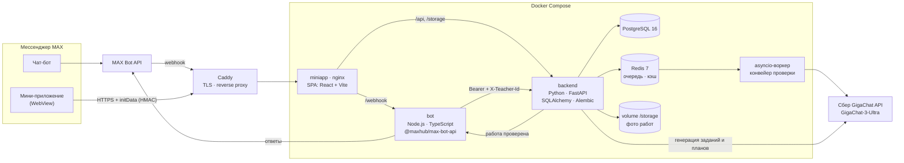
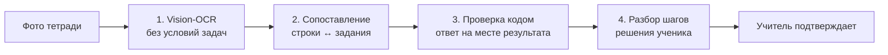

# Помощник учителя — чат-бот и мини-приложение в MAX

Помощник учителя математики 1–4 классов прямо в мессенджере MAX:
проверяет контрольные по фото тетрадей и показывает ход решения
каждого ученика, генерирует домашние задания и годовые учебные планы.


## Где проверить

| Что | Где |
|---|---|
| Чат-бот в MAX | https://max.ru/t680_hakaton_max_bot (`@t680_hakaton_max_bot`) |
| Мини-приложение | https://max.ru/t680_hakaton_max_bot?startapp=tab_check |
| API | https://max.nc-group.space/api |
| Документация API (Swagger) | https://max.nc-group.space/api/docs |
| Проверка доступности | https://max.nc-group.space/api/health → `{"status":"ok"}` |

Логины и пароли не нужны: вход по аккаунту MAX, мини-приложение
авторизуется подписанными данными MAX (`initData`, HMAC-SHA256).
Запросы к API без мессенджера — с сервисным токеном бота:

```bash
curl -H "Authorization: Bearer $MAX_BOT_TOKEN" \
     -H "X-Teacher-Id: 999999" \
     https://max.nc-group.space/api/works
```

`X-Teacher-Id` — любое положительное число, это ID учителя: данные
разных учителей изолированы.

## Сценарий проверки

1. Открыть бота в MAX → `/start` → «Открыть мини-приложение».
2. Вкладка **Проверка** → «+ Новая работа» → загрузить PDF или фото
   эталона (задания и ответы распознаются автоматически) либо ввести
   вручную → «+ Новый ученик».
3. «Загрузить фото работ учеников» → выбрать одного или нескольких
   учеников, каждому до 10 фото → «Отправить всё». Фото можно
   прислать и прямо в чат бота (команды `/work` и `/student`).
4. Через 1–2 минуты работа появится в «Работы учеников», бот пришлёт
   уведомление. В карточке: распознанная запись ученика, разбор каждого
   шага решения, вердикт и объяснение → учитель правит и подтверждает.
5. Вкладка **Задания** → «+ Новое задание» → тема и число задач →
   готовое задание можно скачать (TXT/PDF) или через меню «⋮»
   отправить в проверку как контрольную.
6. Вкладка **Планы** → «+ Новый план» → описать класс свободным текстом
   → годовой план по неделям; кнопка 📝 у темы создаёт по ней задание.

Из вкладки «Проверка» доступны профиль ученика (слабые темы,
повторяющиеся ошибки, динамика) и дашборд класса.

## Архитектура



| Сервис | Стек | Роль |
|---|---|---|
| `miniapp` | React 18, Vite 5, TypeScript, MAX Bridge, nginx | Интерфейс учителя; nginx раздаёт SPA и проксирует `/api`, `/storage` → backend, `/webhook` → bot |
| `bot` | Node.js 20, TypeScript, `@maxhub/max-bot-api` | Команды, приём фото в чате, уведомления о готовых проверках |
| `backend` | Python 3.12, FastAPI, SQLAlchemy 2 (async), Alembic, Pydantic | REST API; модули `check` (проверка), `homework` (задания), `roadmap` (планы), `memory` (профиль ученика) — независимы по данным |
| `postgres` | PostgreSQL 16 | Работы, ученики, проверки, профили, задания, планы |
| `redis` | Redis 7 | Очередь проверок с повторами при сбоях, кэш результатов |
| — | GigaChat-3-Ultra (Сбер) | Распознавание почерка, разбор решения, генерация заданий и планов |
| — | PyMuPDF, ReportLab | Чтение PDF эталона, экспорт заданий и планов в PDF |

### Конвейер проверки работы



Модель, распознающая фото, не видит условий задач. Поэтому она не может
«дорешать» за ученика задачу, которую тот не решил. Итог дополнительно
проверяется кодом (`backend/app/modules/check/recognize.py`): всё
сомнительное уходит на ручную проверку, а не засчитывается как «верно».

## Локальный запуск

Нужны Docker и Docker Compose v2, ключи GigaChat API и токен бота MAX.

```bash
git clone https://github.com/Zzzpize/max-hackathon.git
cd max-hackathon
cp .env.example .env
# заполнить GIGACHAT_CLIENT_ID, GIGACHAT_CLIENT_SECRET и MAX_BOT_TOKEN
docker compose up --build
```

Миграции БД применяются автоматически при старте backend.

| Адрес | Что |
|---|---|
| http://localhost | Мини-приложение |
| http://localhost/api/docs | Swagger UI |
| http://localhost/api/health | Проверка backend |
| http://localhost:8000 | Backend напрямую |

Локально бот работает через long polling и не требует публичного адреса.
Мини-приложение в обычном браузере откроется, но данные не загрузятся:
API принимает только подписанный `initData` из MAX. Для запросов без MAX
используйте сервисный токен (пример выше, с `http://localhost/api`).

Тесты backend:

```bash
cd backend
pip install -r requirements-dev.txt
pytest
```

## Переменные окружения

Полный список с комментариями — в [`.env.example`](.env.example).

| Переменная | Обязательна | Назначение |
|---|---|---|
| `GIGACHAT_CLIENT_ID`, `GIGACHAT_CLIENT_SECRET` | да* | Ключи GigaChat API (developers.sber.ru) |
| `GIGACHAT_AUTH_KEY` | да* | Альтернатива паре выше — готовый base64-ключ |
| `GIGACHAT_SCOPE` | нет | `GIGACHAT_API_PERS` (физлицо) или `GIGACHAT_API_CORP` |
| `GIGACHAT_MODEL` | нет | По умолчанию `GigaChat-3-Ultra`, нужна модель с vision |
| `MAX_BOT_TOKEN` | да | Токен бота MAX; им же подписывается `initData` мини-приложения |
| `MAX_BOT_USERNAME` | нет | Username бота без `@`; кнопка «Открыть мини-приложение» работает и без него |
| `MAX_WEBHOOK_DOMAIN`, `MAX_WEBHOOK_SECRET` | prod | Публичный домен для webhook; без него — long polling |
| `MINIAPP_PUBLIC_URL` | prod | Публичный https-адрес мини-приложения |
| `DATABASE_URL`, `REDIS_URL`, `POSTGRES_*`, `STORAGE_DIR` | нет | Значения из примера подходят для Docker Compose |

\* нужна либо пара `CLIENT_ID` + `CLIENT_SECRET`, либо `GIGACHAT_AUTH_KEY`.

## Прод

Сервер — VPS в РФ, Docker Compose. Снаружи доступен только Caddy
(TLS, Let's Encrypt), он проксирует домен в контейнер `miniapp`;
PostgreSQL, Redis, backend и bot доступны только внутри docker-сети.
Серверный override `docker-compose.prod.yml` убирает проброс портов,
включает webhook бота и подключает `miniapp` к сети Caddy.

Деплой — `python deploy.py [сервис ...]`: упаковывает репозиторий,
загружает по SFTP и выполняет `docker compose up --build`.
Реквизиты сервера берутся из переменных `DEPLOY_HOST`, `DEPLOY_USER`,
`DEPLOY_PASSWORD`, `DEPLOY_PATH`.

В образы bot и backend установлены российские корневые сертификаты
(Минцифры) — без них не устанавливается TLS с MAX и GigaChat.

## Данные учеников

- Настоящие имена учеников не хранятся в PostgreSQL: в базе только хэш,
  а имя — в отдельном файле учителя на сервере.
- Имена из базы в GigaChat не передаются: в модель уходят только фото
  тетрадей и условия заданий. GigaChat — российская инфраструктура.
- Все данные изолированы по учителю: чужие работы, ученики и задания
  недоступны.
- Оценка появляется только после подтверждения учителем.

## Ограничения

- Математика 1–4 классов, рукописные работы.
- Неразборчивый почерк или нестандартная запись → задача уходит
  на ручную проверку.
- Бесплатный тариф GigaChat обрабатывает запросы в один поток:
  проверка одной работы занимает 1–2 минуты, работы идут по очереди.
- Фото: JPEG/PNG/WEBP до 10 МБ, до 10 фото на ученика.

## Структура репозитория

```
backend/     FastAPI: routers/, modules/ (check, homework, roadmap, memory,
             dashboard, generate), models/, migrations/ (Alembic), tests/
bot/         Бот MAX на Node.js + TypeScript
miniapp/     Мини-приложение: React + Vite, nginx.conf
openapi.yaml Контракт REST API
deploy.py    Деплой на сервер одной командой
```

## Команда

- **Frontend + MAX + DevOps** — мини-приложение, бот, инфраструктура, деплой.
- **Backend + LLM** — API, конвейер проверки, генерация заданий и планов.
- **PM / аналитика** — продукт, пилот, тестирование.
